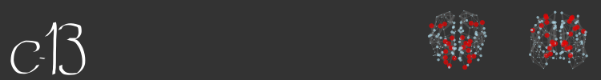

Source code for our opensource site showcasting our wiki entries, pipelines and opensource projects.  

## Contents

- [MRI introduction](#introduction)
- [Wiki MRIlab](#wiki)
- [External tutorials](#external)
- [MRI art](#author)
- [C-13 Friends](#license)

## Introduction to MRI-lab: The Survival Kit  
Welcome to the MRIlab website, here you can find useful links for better understanding of proper use of the cluster and introductory information for computational analysis (MRI, histology, etc).

## Wiki MRI-lab  
A [wiki](https://en.wikipedia.org/wiki/Wiki) is a website on which users collaboratively modify content and structure directly from the web browser. Thus, our MRI-Wiki aim is to maintain updated content for the cluster usage, MRI analysis and other computational tools of interest.  
This wiki is made and updated by all the members of the MRI-lab and for all of us.

## External tutorials and interesting links  
[BATMAN](http://www.miccai.org/edu/finalists/BATMAN_trimmed_tutorial.pdf) Basic and Advanced Tractography with MRtrix for All Neurophiles  
[R for data science](https://r4ds.had.co.nz/index.html) The website for "R for data science", an interesting book with examples and visualizations.  
[R graph gallery](https://www.r-graph-gallery.com) Hundreds of distinctive graphics made with R.  
[Connectopedia](http://www.fmritools.com/kdb/index.html?fbclid=IwAR1Cqmfth-2c8cXBcKYmhN6-YFTLf_1kF7-vxwVg_ZDMiAD4qX-bIeJqzl0) Connectopedia Explorer, the Interactive Atlas of Human Brain Anatomy, Vasculature and Functions.   
[Atlases/resources](http://www.lead-dbs.org/helpsupport/knowledge-base/atlasesresources)  LEAD-DBS a list of useful human and macaque atlases cortical and subcortical.  

## MRI art  
As a proof of our enthusiastic creativity you can find some artistic representations of our work performed by our lab members on this [post]().

## C-13 Friends  

[Facebook](https://www.facebook.com/conectividadcerebral/)
