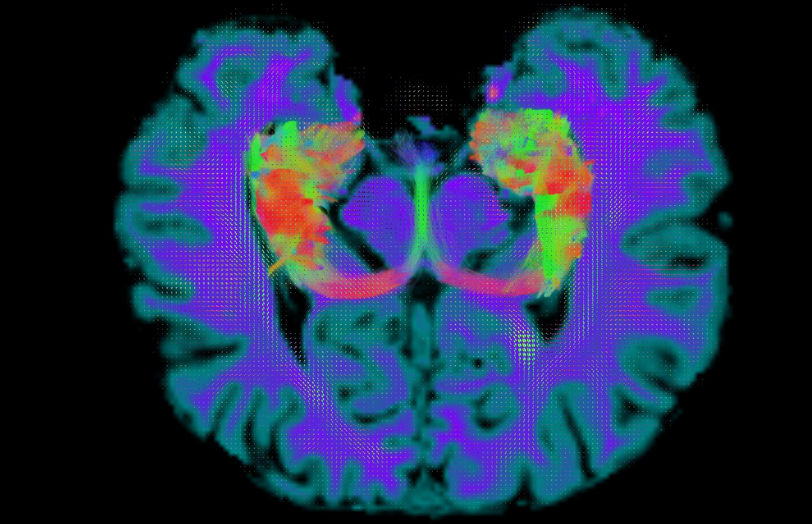

<html>
<head>
<meta charset="utf-8" />
<title>MRI art</title>

<h1> Brain Imaging Gallery </h1>
As a proof of our enthusiastic creativity you can find some artistic representations of our work performed by our lab members  

<h1> Sagital Brain Tractography </h1>
Winning photo of the "Scientific Photography Contest 2014" by Guadalupe Gomar  
<figure>

</figure>

<h1> Axial Hippocampus and fornix </h1>
Tractography of hippocampus and fornix of an axial section of the brain by Raúl RC  
<figure>

</figure>

<h1> Brain </h1>
by Alfonso Fajardo
<figure>

</figure>
