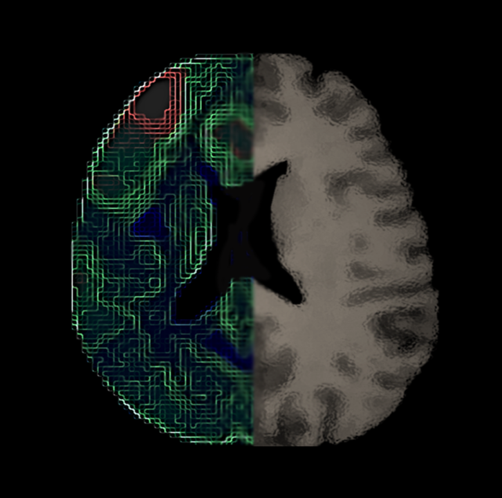

# Brain Imaging Gallery  
As a proof of our enthusiastic creativity you can find some artistic representations of our work performed by our lab members  

## Sagital Brain Tractography  
Winning photo of the "Scientific Photography Contest 2014" by Guadalupe Gomar  
  

##  Axial Hippocampus and fornix  
Tractography of hippocampus and fornix of an axial section of the brain by Raúl RC  
  

## Brain  
by Alfonso Fajardo  
  
